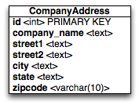
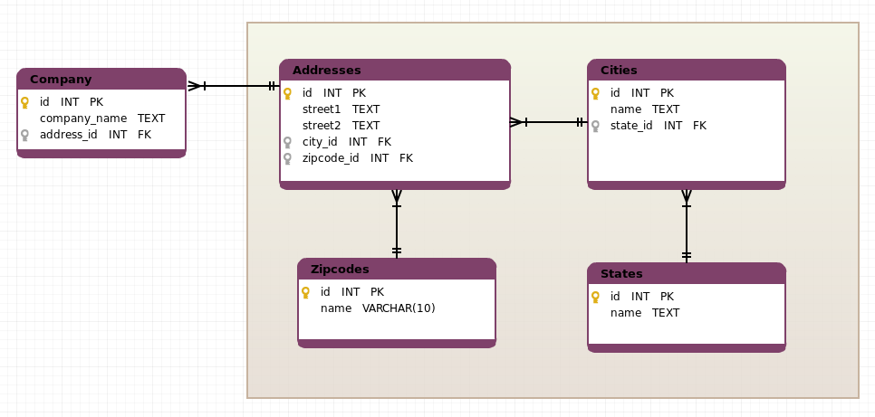

# #1: Only normal?

## Create a data model that allows you maximize normalization
> Take this simple model for storing an address: 


My solution disregards that you can have the same City name in different States.
```Python
from django.db import models

class States(models.Model):
    name = models.TextField()

class Cities(models.Model):
    name = models.TextField()
    state_id = models.ForeignKey('States')

class Zipcodes(models.Model):
    name = models.CharField(max_length=10)

class Addresses(models.Model):
    street1 = models.TextField()
    street2 = models.TextField()
    city_id = models.ForeignKey('Cities')
    zipcode_id = models.ForeignKey('Zipcodes')

class Company(models.Model):
    company_name = models.TextField()
    address_id = models.ForeignKey('Addresses')
```


## Describe how would you recommend setting up an API for the frontend development team to access your normalized model
Access to database fields for the front-end developer should be very simple. He should not have to deal with SQL queries to fetch data and other things that are related to backend. Therefore, I would have implemented methods for data model that are letting create, retrieve, update and delete objects in database. This meaning that methods that generate SQL queries are for database. Then I would have implemented a template engine that is needed to replace from special constructions (template language) in templates to data (obtained at the output of model methods).  
For example, as it is implemented in Django, where a template is rendered with a context. Rendering replaces variables with their values, which are looked up in the context, and executes tags.  

## Describe what are the advantages and disadvantages your normalized model
- advantages normalized model:
  - Storing data in more optimal way
  - Tables are smaller 
  - The updates are very fast (data is located at a single place)
- disadvantages normalized model: 
  - Reading the data from many tables will take a performance hit, because increased the numbers of JOINs

## Bonus. If we had to transition a database from using the above model to your model, what are the steps you would take to minimize downtime? Assume that only one web application is accessing this model.
Steps:
1. Make backup of database
2. Prepare changed code of application for new model
3. Make migration scripts for new model
4. Stop application
5. Deploy new code to server
6. Run migrations
7. Start application

# #2: A race against the clock

## Identify where the race condition is in the code
In file `models.py`, Lines 36-37 and 46-47

## Explain why it is a race condition
This is a race condition because the save is wrapped in transaction and if transaction isn't committed yet then updated changes are not available for other connections like calling celery task. Race conditions occur at the time of the calling celery task whether the task will start before or after the transaction is completed. If the task will start before the transaction is committed then it reads the old state of the object and an error appears.

## Explain or provide a solution to how you would solve it
**For Django >= 1.9**, you can use the on_commit hook  
replace line 37 to:
```python
transaction.on_commit(lambda: send_change_of_name.delay(self.id))
```
and replace line 47 to:
```python
transaction.on_commit(lambda: send_change_of_zipcode.delay(self.id))
```

**For Django < 1.9**, use [django-transaction-hooks](https://django-transaction-hooks.readthedocs.io/en/latest/). The solution is very similar  
replace line 3 to:
```python
from django.db import models, transaction, connection
```
replace line 37 to:
```python
connection.on_commit(lambda: send_change_of_name.delay(self.id))
```
and replace line 47 to:
```python
connection.on_commit(lambda: send_change_of_zipcode.delay(self.id))
```

# #3: APIs to the rescue?

[Solution_1](rescue1.py)    [Solution_2](rescue2.py)

# Bonus: Lists of Lists of Lists of Lists of...

[Solution](bonus.py)